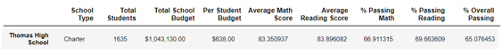

# **School-District-Analysis**

## **Overview of the School District Analysis**

	After submitting the school district analysis to the school board for review, it is found that the ninth grade scores for Thomas High School have been altered thus giving a false outcome. The school board is now requesting the analysis be redone but to exclude the altered scores. The same analysis is redone without the altered scores, on the same seven metrics. To exclude the ninth grade math and reading scores for Thomas High School, the grades are replaced with NaN. 

## **Results** Comparing the outcomes of the original analysis and the new. 

 	Prior to redoing the analysis, the math and reading scores for Thomas High School are replaced with NaN by using the follow code:

   `student_data_df.loc[(student_data_df["school_name"]=="Thomas High School") & (student_data_df["grade"]== "9th"),["reading_score"]]=np.na`

   `student_data_df.loc[(student_data_df["school_name"]=="Thomas High School") & (student_data_df["grade"]== "9th"),["math_score"]]=np.nan`
     

* **District Summary** 
	In the original district summary the percentage for the average reading score is 81.9% and for math it is 75%. 

	Once the ninth grade scores for Thomas High School are excluded, the reading scores percentage is 81.9% and for math is is 74.8%. By excluding the altered scores, only the math percentage was affected by less than 1%. If the math percentage for the new analysis was rounded up, it would equal to the math score in the original analysis.	

	
* **School Summary** 
	The school summary provides the overall passing percentage for each school. In the original, Thomas High School had an overall passing percentage of 90.94. 

	In the new analysis the overall passing percentage is now 65.07. It is evident that the altered ninth grade scores had a significant impact on the overall passing percentage. 	

* **High and Low Performing Schools**
	Part of the school district analysis, is to determine the top performing schools. Originally, Thomas High School was the top 2nd performing school.

	In the new analysis, they are no longer in the top 5 performing schools; however they're not at the bottom. Without the altered ninth grade scores, they fall to eight place.	

*New School Ranking*

* **Math and Reading Scores by Grade**
	Comparing the original and new math and reading scores, removing the ninth grade scores did not seem to have an impact on the outcome of the new analysis. The images below are the original. 

	In the new analysis, the 9th grade scores are replaced by NaN. The math and reading scores for 10th, 11th, and 12th grades are still the same as shown below. 

 

* **Scores by School Spending**
	In the original analysis, the total budget per student for Thomas High School was $638 and the total was $1,043,130.

	Although the ninth grade scores for reading and math are not included in the original analysis, the student population remains the same, 1,635 as well as the per student budget, $635 and total school budget $1,034,130. 

 

* **Scores by School Size**
	There are three categories for school size that is dependent on the student population. The three categores are, small (<1000), medium (1000-1999), and large (2000-5000). Thomas High School has a total student population of 1,635, which puts it in the medium category. In the original analysis, the average scores for the medium size schools are, math = 83.37 and reading 83.86. When the percentage format is applied, they come out to math = 83.4 and reading 83.9. 

	

	In the new analysis, the average scores for the medium schools are math = 83.36 and reading = 83.87. The percentage format, the scores come out to, math = 83.4 and reading 83.9. 

	There does not seem to be much of a difference between the original and new analysis. Prior to applying the percentage formatting we can see only the reading scores were impacted by less than one percent. 

* **Scores by School Type**
	The final analysis provides the average scores by the two different school types, Charter and District. Since Thomas High School is a Charter school, there should be some difference in the overall passing percentage. The original overall passing percentage for charters schools is 90.43, which comes out to 90% when the percentage format is applied. 
	

	The overall percentage charter schools drops to 87.19 or 87 percent when the ninth grade scores are excluded. There is a small but noticeable difference in the average scores. 

## **Summary**
	Finally, we see the impact that exlcuding the ninth grade scores for Thomas High School had on the school on an individual basis and the charter schools overall. 

	1.) Thomas High School ranking fell from second place to eighth place.

	2.) The overall passing score for reading dropped from the original analysis.

	3.) The overall passing percentage fell from 90.94 to 65.07 

	4.) The charter schools overall passing percentage dropped from 90 to 87.
	

	
	
	
	

	

	

	
	
		
